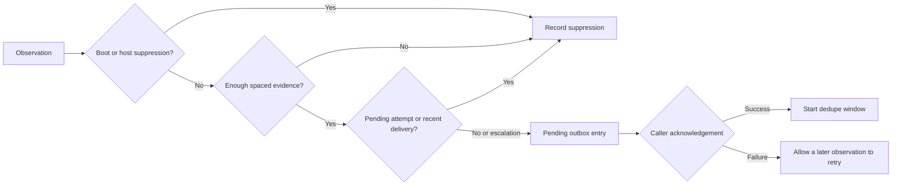

# From a private runtime to a portable example

The private system uses shell scripts, scheduled jobs, and machine-specific health probes. Those integrations are deliberately absent here. The public example takes structured observations so a reader can inspect the policy without installing jobs or connecting accounts.

The earlier implementation supplied the core alert policy: boot suppression, host-health suppression, spaced confirmations, deduplication, and escalation. Its job audit supplied the distinction between process liveness and evidence of successful work. This edition implements those ideas with explicit clocks and transactional state, rather than presenting the operational scripts as a reusable library.

## Alert lifecycle

All observations, state changes and outbox decisions are committed in one SQLite transaction. The transport is outside that transaction, so this design does not promise exactly-once notification delivery.

Event IDs make exact retries idempotent. Reusing an ID for a different payload fails. The stored policy must match on reopen so a process cannot silently reinterpret an existing confirmation history with new thresholds.

A clear observation resets the incident and cancels pending attempts. Cancellation cannot retract a message already sent by an external worker. A real adapter needs its own claim, cancellation and reconciliation rules.

## Deliberate trade-offs

- Time is supplied by the caller for reproducible tests. Production deployments need a defined clock source and skew policy.
- A pending attempt blocks new attempts, including escalation. This avoids duplicate ownership but requires operational resolution of abandoned attempts. The demo never guesses whether a timed-out delivery actually happened.
- The policy uses one incident class at a time. Confirmation is about a persistent problem in that class, rather than independent statistical evidence.
- The outbox contains metadata only. A real transport should keep sensitive message bodies out of general logs and apply retention rules.
- `job_health` assumes a fixed expected period plus grace. Calendar schedules, planned skips and business-day semantics need a separate schedule adapter.

## What changed for publication

The release adds transactional decisions, input validation, explicit delivery acknowledgement and concurrency tests. The fixture timeline is invented. It does not reproduce private incidents or claim these new components are deployed in the original runtime.
