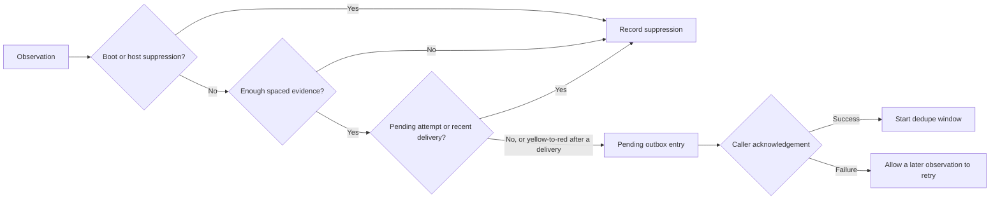

# From a private runtime to a portable example

The private system uses shell scripts, scheduled jobs, and machine-specific health probes. Those integrations are deliberately absent here. The public example takes structured observations so a reader can inspect the policy without installing jobs or connecting accounts. Lessons from running the private system are in [operations-notes.md](operations-notes.md).

The earlier implementation supplied the core alert policy: boot suppression, host-health suppression, spaced confirmations, deduplication, and escalation. Its job audit supplied the distinction between process liveness and evidence of successful work. This edition implements those ideas with explicit clocks and transactional state, rather than presenting the operational scripts as a reusable library.

## Alert lifecycle

Each observation, its state change and any outbox entry are committed in one SQLite transaction. The transport is outside that transaction, so this design does not promise exactly-once notification delivery.

Event IDs make exact retries idempotent. Reusing an ID for a different payload fails. The stored policy must match on reopen so a process cannot silently reinterpret an existing confirmation history with new thresholds.

A clear observation resets the incident and cancels pending attempts. Cancellation cannot retract a message already sent by an external worker. A real adapter needs its own claim, cancellation and reconciliation rules.

## Deliberate trade-offs

- Time is supplied by the caller for reproducible tests. Production deployments need a defined clock source and skew policy.
- A pending attempt blocks new attempts, including escalation. This avoids duplicate ownership but requires operational resolution of abandoned attempts. The demo never guesses whether a timed-out delivery actually happened.
- The policy uses one incident class at a time. Confirmation is about a persistent problem in that class, rather than independent statistical evidence.
- The outbox contains metadata only. A real transport should keep sensitive message bodies out of general logs and apply retention rules.
- `job_health` assumes a fixed expected period plus grace. [`schedule.py`](../schedule.py) adds the calendar side as pure functions: `due_slots` replays launchd-style calendar specs inside a two-hour catch-up window, at most once per slot, and `audit` grades run evidence per job, ignoring zero-byte logs and giving a newly installed job one period before it can be late. It does not read plists or logs, start jobs, model daylight-saving transitions, replay per-minute schedules, or know about holidays and other planned skips.

## What changed for publication

The release adds transactional decisions, input validation, explicit delivery acknowledgement and concurrency tests. The fixture timeline is invented and does not reproduce a private incident. The release does not claim these new components are deployed in the original runtime.

`schedule.py` is a new implementation of the private dispatcher and job audit rules; the private scripts read plists, logs and `launchctl` directly and are not published. It differs from them on purpose in four places: it rejects entries without `Minute` or with both `Day` and `Weekday` instead of guessing, its catch-up window can cross midnight, a calendar job's period is its longest real gap rather than a rounded estimate, and an interval job whose only signal is a loaded status is `UNKNOWN` rather than `OK`. `guards/notify-guard.sh` is adapted from the private guard: its patterns are the same, the first lines are read with bash builtins instead of a pipe, and its test fixtures are neutral sentences.
